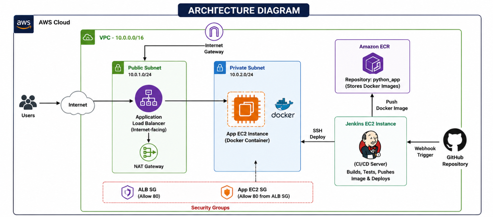
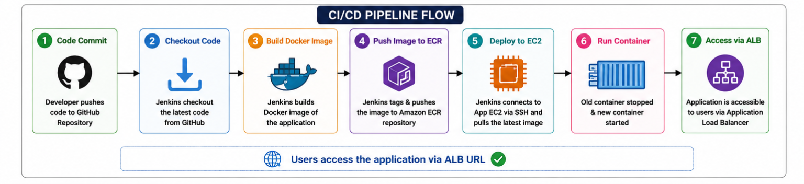

# 🚀 CI/CD upGrad Project – Python Voting App

## 👤 Author
**Akash Maiyar**

---

## 📌 Project Overview
This project demonstrates a complete **CI/CD pipeline** for deploying a Python-based voting application using:

- AWS (EC2, VPC, ALB, ECR)
- Jenkins
- Docker
- Terraform
- GitHub

The pipeline automates the entire workflow:

➡️ Code Commit → Build → Docker Image → Push to ECR → Deploy on EC2 → Access via ALB

---

## 🏗️ Architecture Diagram

---

## 🔄 CI/CD Pipeline Flow

---

## ⚙️ Tech Stack

- **Frontend/Backend:** Python (Flask)
- **Containerization:** Docker
- **CI/CD:** Jenkins
- **Cloud:** AWS (EC2, ECR, ALB, VPC)
- **Infrastructure as Code:** Terraform
- **Version Control:** GitHub

---

## 📂 Project Structure
