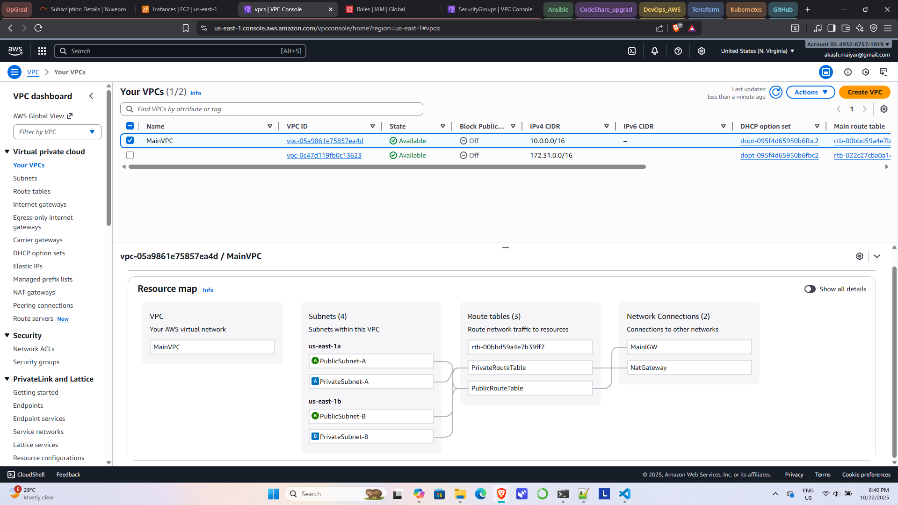
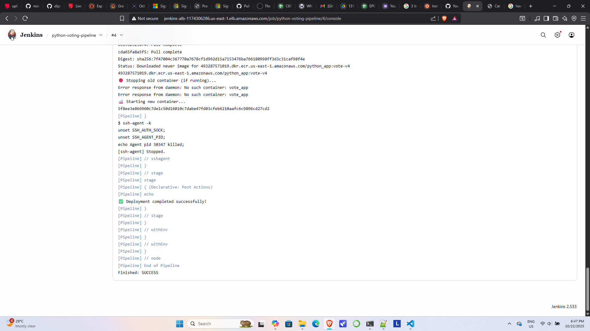
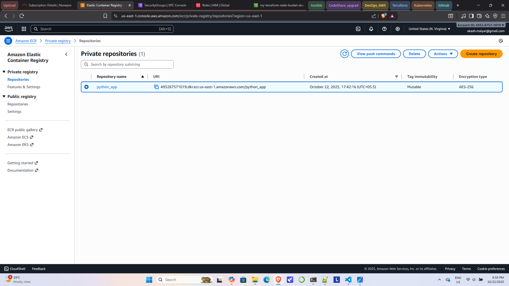
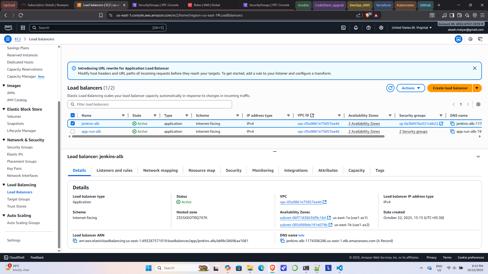
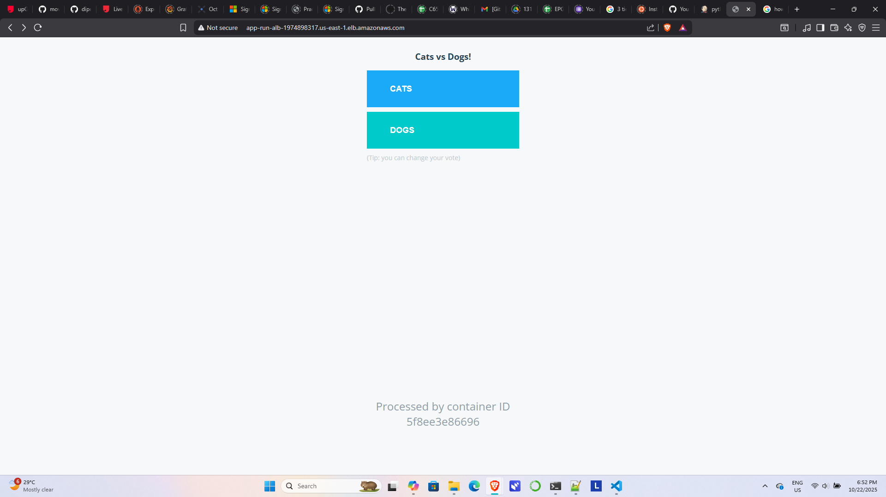

# 🚀 CI/CD upGrad Project – Python Voting App

## 👤 Author
**Akash Maiyar**

---

## 📌 Project Overview
This project demonstrates a complete **CI/CD pipeline** for deploying a Python-based voting application using:

- AWS (EC2, VPC, ALB, ECR)
- Jenkins
- Docker
- Terraform
- GitHub

The pipeline automates the entire workflow:

➡️ Code Commit → Build → Docker Image → Push to ECR → Deploy on EC2 → Access via ALB

---

## 🏗️ Architecture Diagram


---

## 🔄 CI/CD Pipeline Flow


---

## ⚙️ Tech Stack

- **Frontend/Backend:** Python (Flask)
- **Containerization:** Docker
- **CI/CD:** Jenkins
- **Cloud:** AWS (EC2, ECR, ALB, VPC)
- **Infrastructure as Code:** Terraform
- **Version Control:** GitHub

---

## 📂 Project Structure

# Project Structure

```bash
python-voting-app/
│
├── vote/
│   ├── app.py
│   ├── requirements.txt
│   ├── Dockerfile
│
├── Jenkinsfile
│
├── terraform/
│   ├── main.tf
│   ├── variables.tf
│   ├── outputs.tf
│
├── docs/
│   ├── architecture.png
│   ├── pipeline-flow.png
│   ├── screenshots/
│   ├── vpc.png
│   ├── jenkins.png
│   ├── ecr.png
│   ├── alb.png
│   ├── app-output.png
│
├── README.md
└── .gitignore
```

---

## 🐳 Dockerization

- Base Image: `python:3.9-slim`
- Installed dependencies using `requirements.txt`
- Application exposed on **port 80**
- Used **Gunicorn** for production server

---

## 🔁 Jenkins Pipeline

### Pipeline Stages:

1. **Checkout Code**
2. **Build Docker Image**
3. **Push Image to AWS ECR**
4. **Deploy to EC2 via SSH**

---

## 📦 ECR Repository

- Repository Name: `python_app`
- Region: `us-east-1`
- Stores versioned images:
python_app:vote-v1
python_app:vote-v2
python_app:vote-v3


---

## 🚀 Deployment Process

1. Developer pushes code to GitHub
2. Jenkins triggers pipeline
3. Docker image is built
4. Image pushed to ECR
5. Jenkins SSH into App EC2
6. Old container stopped
7. New container started
8. Application served via ALB

---

---

## 📸 Screenshots

### 🔹 VPC Setup


### 🔹 Jenkins Pipeline Success


### 🔹 ECR Repository


### 🔹 ALB Target Healthy


### 🔹 Final Application Output


---

## ✅ Final Output

The application is successfully deployed and accessible via ALB showing:

👉 **Cat vs Dog Voting Application**

---

## 📚 Key Learnings

- End-to-end CI/CD pipeline implementation
- Docker image lifecycle management
- AWS networking (VPC, subnets, SGs)
- Jenkins automation
- Load balancing with ALB

---

## 🔮 Future Improvements

- Add HTTPS using ACM
- Implement auto-scaling
- Use Kubernetes (EKS)
- Add monitoring (CloudWatch / Prometheus)

---

## ⭐ Conclusion

Successfully built a production-ready CI/CD pipeline integrating **GitHub, Jenkins, Docker, AWS ECR, EC2, and ALB**, enabling automated deployment and scalable application access.
